# README

This is the repository template used for student repositories in LAPR Projets.

## Java source files

Java source and test files are located in folder src.

## Maven file

Pom.xml file controls the project build.

### Notes
In this file, DO NOT EDIT the following elements:

* groupID
* artifactID
* version
* properties

Beside, students can only add dependencies to the specified section of this file.

## Eclipse files

The following files are solely used by Eclipse IDE:

* .classpath
* .project

## IntelliJ Idea IDE files

The following folder is solely used by Intellij Idea IDE :

* .idea

# How was the .gitignore file generated?
.gitignore file was generated based on https://www.gitignore.io/ with the following keywords:

  - Java
  - Maven
  - Eclipse
  - NetBeans
  - Intellij

# Who do I talk to?
In case you have any problem, please email Nuno Bettencourt (nmb@isep.ipp.pt).

# How do I use Maven?

## How to run unit tests?

Execute the "test" goals.

```shell
$ mvn test
```
## How to generate the javadoc for source code?

Execute the "javadoc:javadoc" goal.

```shell
$ mvn javadoc:javadoc
```
This generates the source code javadoc in folder "target/site/apidocs/index.html".

## How to generate the javadoc for test cases code?

Execute the "javadoc:test-javadoc" goal.

```shell
$ mvn javadoc:test-javadoc
```
This generates the test cases javadoc in folder "target/site/testapidocs/index.html".

## How to generate Jacoco's Code Coverage Report?

Execute the "jacoco:report" goal.

```shell
$ mvn test jacoco:report
```

This generates a jacoco code coverage report in folder "target/site/jacoco/index.html".

## How to generate PIT Mutation Code Coverage?

Execute the "org.pitest:pitest-maven:mutationCoverage" goal.

```shell
$ mvn test org.pitest:pitest-maven:mutationCoverage
```
This generates a PIT Mutation coverage report in folder "target/pit-reports/YYYYMMDDHHMI".

## How to combine different maven goals in one step?

You can combine different maven goals in the same command. For example, to locally run your project just like on jenkins, use:

```shell
$ mvn clean test jacoco:report org.pitest:pitest-maven:mutationCoverage
```
## How to perform a faster pit mutation analysis?

Do not clean build => remove "clean"

Reuse the previous report => add "-Dsonar.pitest.mode=reuseReport"

Use more threads to perform the analysis. The number is dependent on each computer CPU => add "-Dthreads=4"

Temporarily remove timestamps from reports.

Example:
```shell
$ mvn test jacoco:report org.pitest:pitest-maven:mutationCoverage -DhistoryInputFile=target/fasterPitMutationTesting-history.txt -DhistoryOutputFile=target/fasterPitMutationTesting-history.txt -Dsonar.pitest.mode=reuseReport -Dthreads=4 -DtimestampedReports=false
```
## Where do I configure my database connection?

Each group should configure their database connection on the file:
* src/main/resources/application.properties  

## Relatory  

# US_102 - to search the details of a ship using any of its codes: MMSI, IMO or Call Sign

## 1. Requirements Engineering

### 1.1. User Story Description

As a **traffic manager**, I wish to search the details of a ship using **any of its codes**: MMSI, IMO or Call Sign

### 1.2. Customer Specifications and Clarifications


**From the client clarifications:**

> **Question:Should the traffic manager choose which type of code(MMSI, IMO, Call sign) to enter and then enter it or should the system automatically recognize which code is it depending on the syntax of the code??
>
> **Answer:** Humm, if it is possible, it would be better to recognise it automatically.


### 1.3. Acceptance Criteria

* **AC1:** correct use of OOP concepts


### 1.5 Input and Output Data

**Input Data:**

* Typed data:
    * code

**Output Data:**

* ship details
* operation success/failure


### 1.6. System Sequence Diagram (SSD)

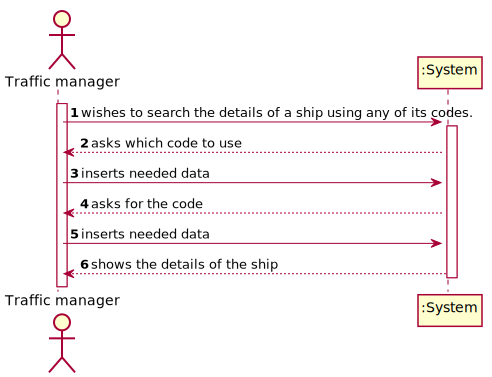


### 1.7 Other Relevant Remarks

The present US is held many times during the business. As the traffic manager does his daily work, he will probably come across with the need to search for ship details many times.


## 2. OO Analysis

### 2.1. Relevant Domain Model Excerpt


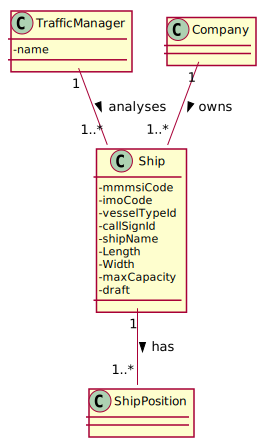


### 2.2. Other Remarks

n/a


## 3. Design - User Story Realization

## 3.2. Sequence Diagram (SD)

### 3.2.1 Sequence Diagram

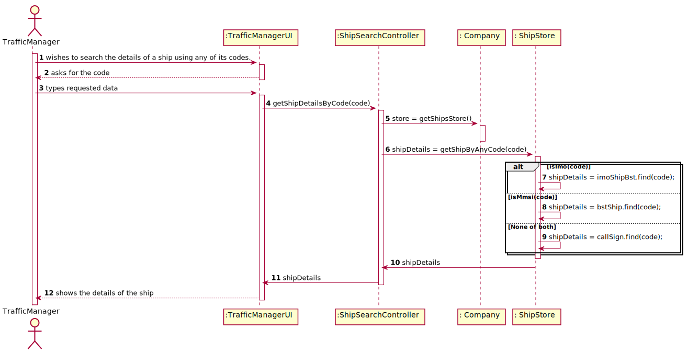

## 3.3. Class Diagram (CD)

### 3.3.1 Class Diagram

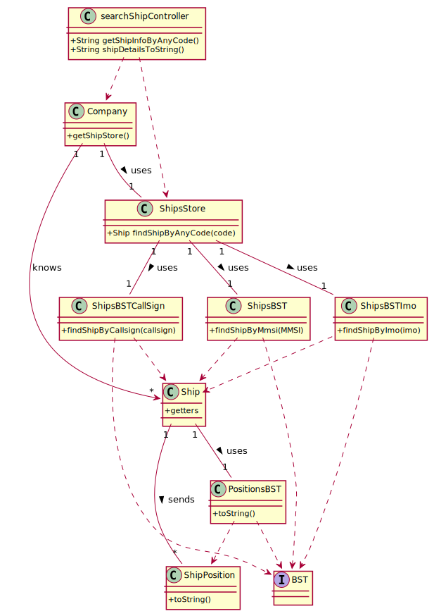

# 4. Tests

###4.1 ShipStore class tests:
**Test 1:** Check if method getShipByAnyCode(code) chooses the right type of code depending on syntax.

**Test 2:** Check if method getShipByAnyCode(code) returns the right ship with MMSI code.

**Test 3:** Check if method getShipByAnyCode(code) returns the right ship with IMO code.

**Test 4:** Check if method getShipByAnyCode(code) returns the right ship with CallSign code.

###4.1 ShipBST classes tests:

**Test 5:** Check if search by code method is working properly.

###4.1 Ship class tests:

**Test 6:** Check if getters methods are returning the expected values.

###4.1 searchShipController class tests:

**Test 7:** Check if the integration of all methods is working properly.  


# US 103 - Show Positional Messages

## 1. Requirements Engineering

### 1.1. User Story Description

As a traffic manager, I wish to have the positional messages temporally organized and associated with each of the ships.

### 1.2. Acceptance Criteria

* efficient access of any position value(s) of a ship on a period or date.

### 1.4. Found out Dependencies

* US101: Import ships from a text file into a BST

### 1.5 Input and Output Data

**Input Data:**

* Typed data:
    * MMSI code of ship
    * initial date
    * final date (optional)

* Selected data:
    * n/a


**Output Data:**

* file containing positional messages of the ship


### 1.6. System Sequence Diagram (SSD)

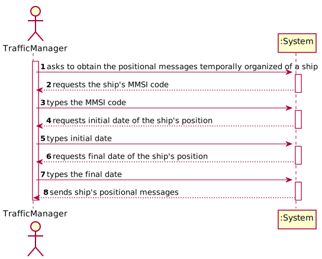


### 1.7 Other Relevant Remarks

n/a


## 2. OO Analysis

### 2.1. Relevant Domain Model Excerpt

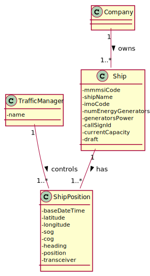

### 2.2. Other Remarks

n/a


## 3. Design - User Story Realization

## 3.1. Sequence Diagram (SD)

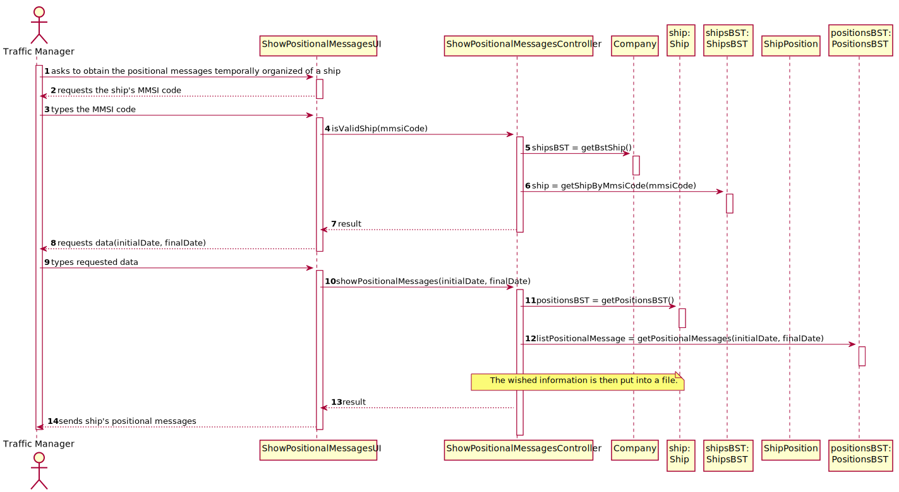

## 3.2. Class Diagram (CD)

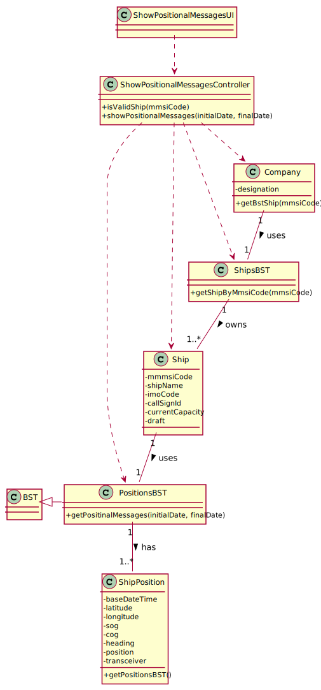

# 4. Tests

### Ship class

**Test 1:** Test to ensure getShipByMmsiCode() is functioning correctly.

Situation 1: the user inserts a MMSI code existent in the system
- an expected Ship object should be created
- the MMSI code of the ship should be put in the parameter of the method getShipByMmsiCode(int mmsiCode)
- an actual Ship object through calling the method
- result: the method returns the corresponding Ship and the Ship objects are equal

```
@Test
    public void getShipByExistentMmsiCode() {
    }
```

**Test 2:** Test to ensure getShipByMmsiCode() is functioning correctly.

Situation 2: the user inserts a MMSI code NON existent in the system
* the invalid MMSI code of the ship should be put in the parameter of the method getShipByMmsiCode(int mmsiCode)
* an actual Ship object through calling the method
* result: the method returns null as the Ship with that MMSI doesn't exist

```
@Test
    public void getShipByNonExistentMmsiCode() {
    }
```

### PositionsBST Class

**Test 3:** Test to ensure getPositionalMessages() is functioning properly

Situation 1: the user wishes to see ship positions in a period
* two Date objects should be created with the initial and final date
* an expected List object should be created containing the expected result (toString of multiple ShipPositions objects)
* the actual List object through calling the method getPositionalMessages()
* result: the Lists should be equal

```
@Test
    public void getPositionalMessagesInAPeriod() {
    }
```

**Test 4:** Test to ensure getPositionalMessages() is functioning properly

Situation 2: the user wishes to see ship positions in a date
* a Date object should be created
* an expected List object should be created containing the expected result (toString of multiple ShipPositions objects)
* the actual List object through calling the method getPositionalMessages()
* result: the Lists should be equal

```
@Test
    public void getPositionalMessagesInADate() {
    }
```

**Test 5:** Test to ensure getPositionalMessages() is functioning properly.

Situation 3: there aren't any positional messages found
* two Date objects should be created with the initial and final date
* an expected empty List object
* the actual List object through calling the method getPositionalMessages()
* result: the Lists should be equal

```
@Test
    public void getPositionalMessagesNotFoundInAPeriod() {
    }
```


# US 104 -As a traffic manager I wish to make a Summary of a ship's movements.

## 1. Requirements Engineering

*In this section, it is suggested to capture the requirement description and specifications as provided by the client as well as any further clarification on it. It is also suggested to capture the requirements acceptance criteria and existing dependencies to other requirements. At last, identfy the involved input and output data and depicted an Actor-System interaction in order to fulfill the requirement.*

### 1.1. User Story Description

As a **traffic manager** I wish to **make a Summary of a ship's movements.**

### 1.2. Customer Specifications and Clarifications

**From the specifications document:**
>Ships are characterized by:
>- MMSI: unique 9-digit ship identification code.
>- Ship name.
>- Ship identification according to the IMO identification.
>- ...
>- Dynamic data fields relating to a ship's positioning data:
>- Base Date Time: date/time of AIS message.
>- Latitude
>- Longitude
>- Speed over ground (SOG).
>- Course over ground (COG): direction relative to absolute North (in degrees: [0; 359]).
>- Heading: ship heading (in degrees: [0; 359], 511 indicates 'not available').
>- Position: ship code in tow.
>- Transceiver Class: class to transceiver used when sending data.

**From the client clarifications:**

>Q1: How shold the ship be selected, from MMSI code, name or IMO?
>
>A2: Any of them.

### 1.3. Acceptance Criteria

* **AC1:** For a given ship return in an appropriate structure one of its codes
  (MMSI, IMO or Call Sign), Vessel Name, Start Base Date Time, End
  Base Date Time, Total Movement Time, Total Number of Movements,
  Max SOG, Mean SOG, Max COG, Mean COG, Departure Latitude,
  Departure Longitude, Arrival Latitude, Arrival Longitude, Travelled
  Distance (incremental sum of the distance between each positioning
  message) and Delta Distance (linear distance between the coordinates of
  the first and last move).

### 1.4. Found out Dependencies

There is a depencency with the craetion of a Ship object, and also with the existence of a Traffic manager role to exist be registered.

### 1.5 Input and Output Data

### 1.6 System Sequence Diagram (SSD)

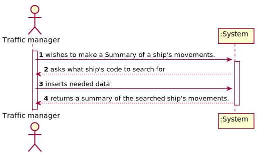

### 1.7 Other Relevant Remarks

## 2. OO Analysis

### 2.1. Relevant Domain Model Excerpt
*In this section, it is suggested to present an excerpt of the domain model that is seen as relevant to fulfill this requirement.*

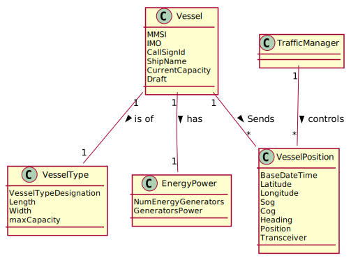

### 2.2. Other Remarks

n/a

## 3. Design - User Story Realization

## 3.2. Sequence Diagram (SD)

*In this section, it is suggested to present an UML dynamic view stating the sequence of domain related software objects' interactions that allows to fulfill the requirement.*

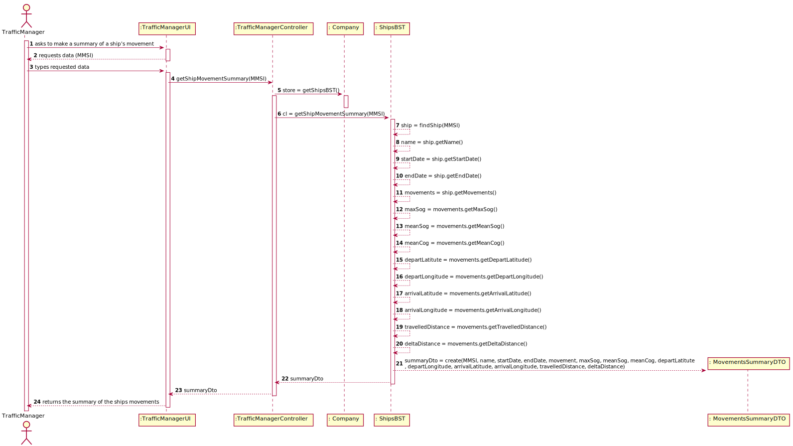

## 3.3. Class Diagram (CD)

*In this section, it is suggested to present an UML static view representing the main domain related software classes that are involved in fulfilling the requirement as well as and their relations, attributes and methods.*

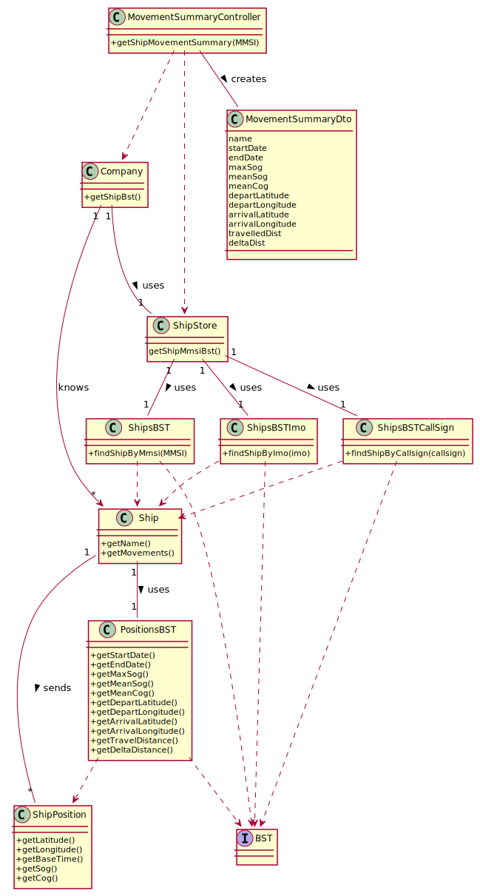

# 4. Tests
*In this section, it is suggested to systematize how the tests were designed to allow a correct measurement of requirements fulfilling.*

**_DO NOT COPY ALL DEVELOPED TESTS HERE_**

###4.1 Ship class tests:
**Test 1:** Check if both getName and getMovements return the expected values.
### 4.2 ShipBst
**Test 2:** Check if the ship is correctly retrieved from MMSI code

### 4.3 ShipMovementsBst tests:
**Test 3** Check if the tree correctly finds the first and last node by dates:
- **Test 3.1** Check if start and end dates are correct.
- **Test 3.2** Check if depart latitude and longitude values are correct.
- **Test 3.3** Check if arrival latitude and longitude values are correct.

**Test 4** Check if Max Sog and Cog values are obtained as expected.

**Test 5** Check if mean values of sog and cog are correct.

**Test 6** Check if calculations of Delta and Travel distances are correct.

### ShipPosition
**Test 7** Check if getters are returning the correct values of attributes  


# US 107 - Show Pairs Of Ships

## 1. Requirements Engineering

### 1.1. User Story Description

As a traffic manager, I wish to have the pairs of ships with route with close departure/arrival coordinates (no more than 5 Kms away) and with different Travelled Distance.

### 1.2. Customer Specifications and Clarifications

### 1.3. Acceptance Criteria

**AC1:** Sorted by the MMSI code of the 1st ship and in descending order of the Travelled Distance difference.    
**AC2:** Do not consider ships with Travelled Distance less than 10 kms.


### 1.4. Found out Dependencies

**US101:** Import ships from a text file into a BST  
**US104:** Summary of a Ship's Movements

### 1.5 Input and Output Data

**Input Data:** n/a

**Output Data:**

* file containing the wished pairs of ships


### 1.6. System Sequence Diagram (SSD)

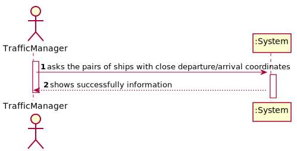


### 1.7 Other Relevant Remarks

n/a


## 2. OO Analysis

### 2.1. Relevant Domain Model Excerpt

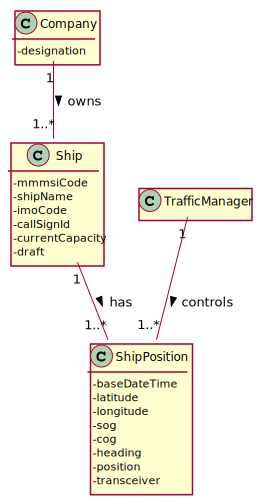

### 2.2. Other Remarks

n/a


## 3. Design - User Story Realization

## 3.1. Sequence Diagram (SD)

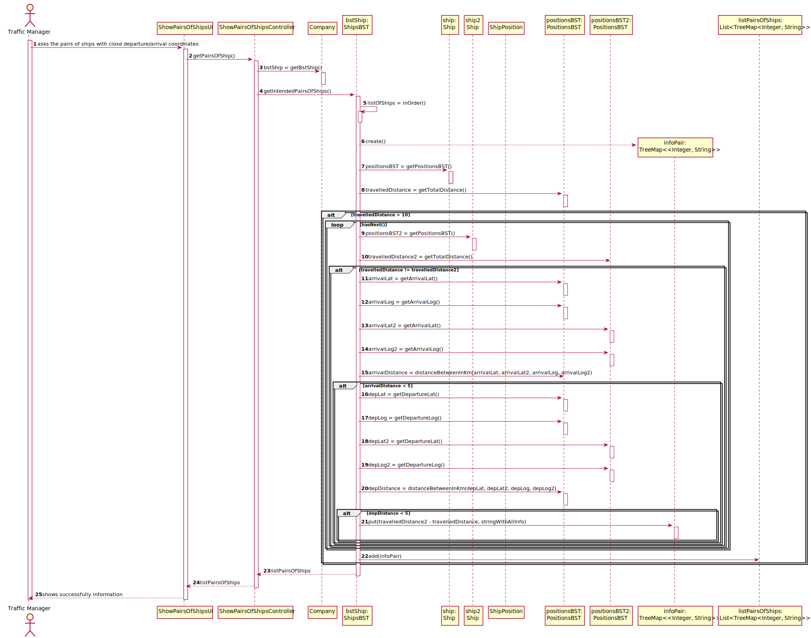

### 3.1.1 Partial Sequence Diagram


## 3.3. Class Diagram (CD)

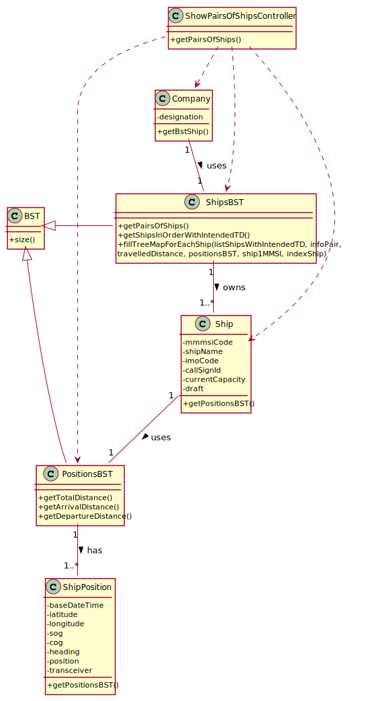

# 4. Tests

### ShipsBST Class

**Test 1:** Test to ensure getShipsInOrderWithIntendedTD works correctly.  
Steps:
* an expected List<Ship> should be created
* the list should be filled with Ship objects in the intended order
* obtain the actual list through calling the method getShipsInOrderWithIntendedTD()
* result: the lists are equal

```
@Test
    void getShipsInOrderWithIntendedTD() {
    }
```

**Test 2:** Test to ensure fillTreeMapEachShip() works correctly.  
Steps:
* create or get a List<Ship> containing a list of Ship objects
* create an expected descending TreeMap using Collections.reverseOrder()
* create the actual descending TreeMap using Collections.reverseOrder()
* obtain the first Ship object of the List<Ship> created
* obtain the index of that Ship
* obtain the PositionsBST of that Ship
* obtain the Travelled Distance of that Ship
* fill the actual TreeMap using the method fillTreeMapForEachShip using the objects and info obtained
* result: the list should be equal or if empty, their sizes should be equal

```
@Test
    void fillTreeMapForEachShip() {
    }
```  

**Test 3:** Test to ensure getPairsOfShips() works correctly.  
Steps:
* create an expected List<TreeMap<Double, String>> containing the expected result if the result is not empty
* create the actual through calling the method getPairsOfShips
* result: the lists should be equal or its sizes, if the result is empty

```
@Test
    void getPairsOfShips() {
    }
```  

OBSERVATION: To facilitate testing this method, we can import information in a .csv file using Controller available from US101.

### PositionsBST Class

**Test 1:** Test to ensure getArrivalDistance(positionsBST2) works properly.  
Steps:
* create a double with the expected result
* create 2 Ship objects with Ship Positions
* obtain the actual result through calling the method
* result: the results are equal

```
public Double getArrivalDistance(positionsBST2) {
}
```

**Test 2:** Test to ensure getDepartureDistance(positionsBST2) works properly.
Steps: see steps from the previous test and use the same logic

```
public Double getDepartureDistance(positionsBST2) {
}
```


