# README

This is the repository template used for student repositories in LAPR Projets.

## Java source files

Java source and test files are located in folder src.

## Maven file

Pom.xml file controls the project build.

### Notes
In this file, DO NOT EDIT the following elements:

* groupID
* artifactID
* version
* properties

Beside, students can only add dependencies to the specified section of this file.

## Eclipse files

The following files are solely used by Eclipse IDE:

* .classpath
* .project

## IntelliJ Idea IDE files

The following folder is solely used by Intellij Idea IDE :

* .idea

# How was the .gitignore file generated?
.gitignore file was generated based on https://www.gitignore.io/ with the following keywords:

  - Java
  - Maven
  - Eclipse
  - NetBeans
  - Intellij

# Who do I talk to?
In case you have any problem, please email Nuno Bettencourt (nmb@isep.ipp.pt).

# How do I use Maven?

## How to run unit tests?

Execute the "test" goals.

```shell
$ mvn test
```
## How to generate the javadoc for source code?

Execute the "javadoc:javadoc" goal.

```shell
$ mvn javadoc:javadoc
```
This generates the source code javadoc in folder "target/site/apidocs/index.html".

## How to generate the javadoc for test cases code?

Execute the "javadoc:test-javadoc" goal.

```shell
$ mvn javadoc:test-javadoc
```
This generates the test cases javadoc in folder "target/site/testapidocs/index.html".

## How to generate Jacoco's Code Coverage Report?

Execute the "jacoco:report" goal.

```shell
$ mvn test jacoco:report
```

This generates a jacoco code coverage report in folder "target/site/jacoco/index.html".

## How to generate PIT Mutation Code Coverage?

Execute the "org.pitest:pitest-maven:mutationCoverage" goal.

```shell
$ mvn test org.pitest:pitest-maven:mutationCoverage
```
This generates a PIT Mutation coverage report in folder "target/pit-reports/YYYYMMDDHHMI".

## How to combine different maven goals in one step?

You can combine different maven goals in the same command. For example, to locally run your project just like on jenkins, use:

```shell
$ mvn clean test jacoco:report org.pitest:pitest-maven:mutationCoverage
```
## How to perform a faster pit mutation analysis?

Do not clean build => remove "clean"

Reuse the previous report => add "-Dsonar.pitest.mode=reuseReport"

Use more threads to perform the analysis. The number is dependent on each computer CPU => add "-Dthreads=4"

Temporarily remove timestamps from reports.

Example:
```shell
$ mvn test jacoco:report org.pitest:pitest-maven:mutationCoverage -DhistoryInputFile=target/fasterPitMutationTesting-history.txt -DhistoryOutputFile=target/fasterPitMutationTesting-history.txt -Dsonar.pitest.mode=reuseReport -Dthreads=4 -DtimestampedReports=false
```
## Where do I configure my database connection?

Each group should configure their database connection on the file:
* src/main/resources/application.properties  

# RELATORY

# SPRINT 1

# US 101 - Import ships from a text file into a BST

## 1. Requirements Engineering

### 1.1. User Story Description

As a traffic manager, I wish to import ships from a text file into a BST

### 1.2. Acceptance Criteria

* no data lost.

### 1.4. Found out Dependencies

This US doesn't have any dependencies.

### 1.5 Input and Output Data

**Input Data:**

* Typed data:
  * text file path

* Selected data:
  * n/a


**Output Data:**

* operation success/failure


### 1.6. System Sequence Diagram (SSD)

!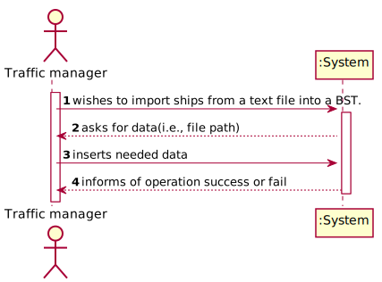


### 1.7 Other Relevant Remarks

The present US isn't held many times during the business. As the business grows, the company might import new ships to the software system, but probably these ships won't be added individually and will only be added once in a large amount of time.


## 2. OO Analysis

### 2.1. Relevant Domain Model Excerpt

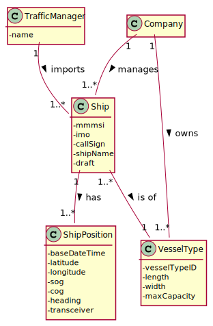

### 2.2. Other Remarks

n/a


## 3. Design - User Story Realization

## 3.1. Sequence Diagram (SD)

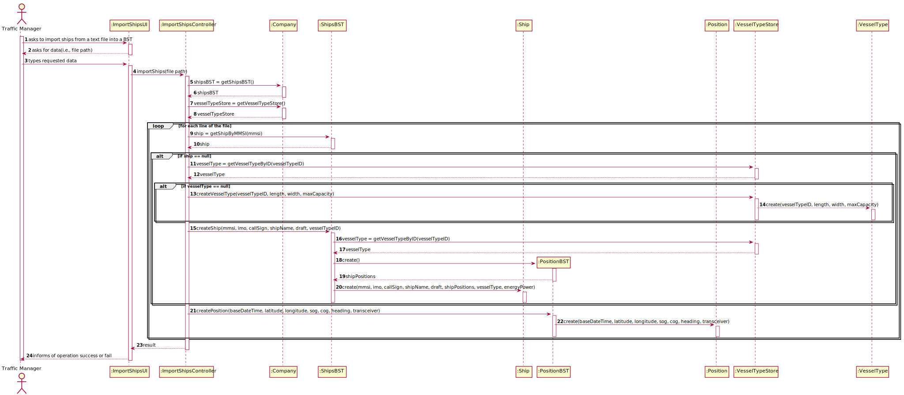

## 3.2. Class Diagram (CD)

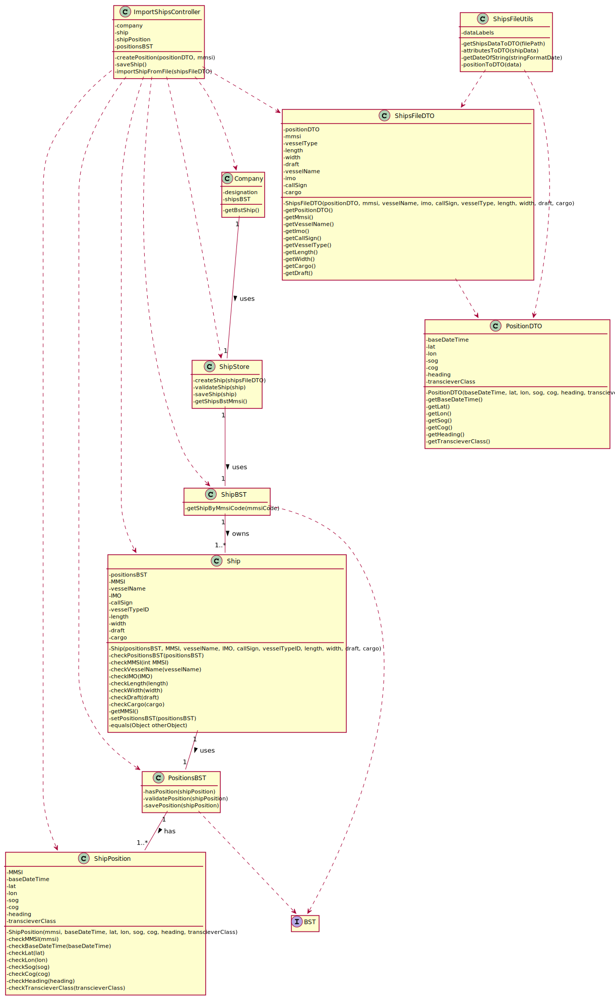

# 4. Tests

### ImportShipsController class test:

**Test 1:** Test to check if the Ships are being imported respecting all the data restrictions.

In order to test this, it's important to create two test .CSV files: one with ships to be imported (it's important that these ships have errors in their attribute values),
and one with only the ships that, after the filtration, are actually imported.
After using the importShipFromFile method (from the Controller) in the ships from the first file, 
only the ones in the second file should be imported.

**Test 2:** Test to check how many ships from a file are imported and which lines do not import.

This test should import the Ships and print the number of the lines that do not import. It should also increment a counting variable everytime a line is imported and print it at the end.


### Ship class tests:

**Test 3:** Ensure empty Positions BST are not allowed

**Test 4:** Ensure MMSI cannot have less than 9 digits.

**Test 5:** Ensure MMSI cannot have more than 9 digits.

**Test 6:** Ensure Vessel Name cannot be null.

**Test 7:** Ensure IMO cannot be blank.

**Test 8:** Ensure IMO cannot have less than 10 chars.

**Test 9:** Ensure IMO cannot have more than 10 chars.

**Test 10:** Ensure IMO starts with "IMO".

**Test 11:** Ensure IMO has only numeric digits after the "IMO" part.

**Test 12:** Ensure Length cannot be under or equal to 0.

**Test 13:** Ensure Width cannot be under or equal to 0.

**Test 14:** Ensure Draft cannot be under or equal to 0.

**Test 15:** Ensure Cargo cannot be under or equal to 0.

**Test 16:** Ensure Cargo can be 0.

**Test 17:** Ensure Cargo can be NA.

Tests 3 to 17 follow this format:

```
@Test
    public void testName() {
      IllegalArgumentException thrown = assertThrows(IllegalArgumentException.class, () -> new Ship(positionsBST, mmsi, vesselName, imo, callSign, vesselTypeID, length, width, draft, cargo));
      assertEquals(".........", thrown.getMessage());
    }
```

The only change in the tests are the test name, the attributes values and the assertEquals.


### ShipPosition class tests:

**Test 18:** Ensure Base Date Time cannot be null.

**Test 19:** Ensure Transciever Class cannot be null.

**Test 20:** Ensure Transciever Class cannot be empty.

**Test 21:** Ensure Latitude cannot be under -90.

**Test 22:** Ensure Latitude cannot be over 91.

**Test 23:** Ensure Latitude can have value 90.

**Test 24:** Ensure Latitude can have value -90.

**Test 25:** Ensure Longitude cannot be under -180.

**Test 26:** Ensure Longitude cannot be over 180.

**Test 27:** Ensure Longitude can have value 180.

**Test 28:** Ensure Longitude can have value -180.

**Test 29:** Ensure SOG cannot be under 0.

**Test 30:** Ensure SOG can have value 0.

**Test 31:** Ensure COG cannot be under 0.

**Test 32:** Ensure Heading cannot be over 359.

**Test 33:** Ensure COG can have value 359.

**Test 34:** Ensure Heading cannot be under 0.

**Test 35:** Ensure Heading cannot be over 511.

**Test 36:** Ensure Heading can have value 0.

**Test 37:** Ensure Heading can have valie 359.

**Test 38:** Ensure MMSI has 9 digits.

**Test 39:** Ensure MMSI cannot have more than 9 digits.

**Test 40:** Ensure MMSI cannot have less than 9 digits.

Tests 18 to 40 follow this format:

```
@Test
    public void testName() {
      IllegalArgumentException thrown = assertThrows(IllegalArgumentException.class, () -> new ShipPosition(mmsi, date, lat,
                lon, sog, cog, heading, transcieverClass));
      assertEquals(".........", thrown.getMessage());
    }
```

The only change in the tests are the test name, the attributes values and the assertEquals.


# US_102 - to search the details of a ship using any of its codes: MMSI, IMO or Call Sign

## 1. Requirements Engineering

### 1.1. User Story Description

As a **traffic manager**, I wish to search the details of a ship using **any of its codes**: MMSI, IMO or Call Sign

### 1.2. Customer Specifications and Clarifications


**From the client clarifications:**

> **Question:Should the traffic manager choose which type of code(MMSI, IMO, Call sign) to enter and then enter it or should the system automatically recognize which code is it depending on the syntax of the code??
>
> **Answer:** Humm, if it is possible, it would be better to recognise it automatically.


### 1.3. Acceptance Criteria

* **AC1:** correct use of OOP concepts


### 1.5 Input and Output Data

**Input Data:**

* Typed data:
    * code

**Output Data:**

* ship details
* operation success/failure


### 1.6. System Sequence Diagram (SSD)


### 1.7 Other Relevant Remarks

The present US is held many times during the business. As the traffic manager does his daily work, he will probably come across with the need to search for ship details many times.


## 2. OO Analysis

### 2.1. Relevant Domain Model Excerpt


### 2.2. Other Remarks

n/a


## 3. Design - User Story Realization

## 3.2. Sequence Diagram (SD)

### 3.2.1 Sequence Diagram


## 3.3. Class Diagram (CD)

### 3.3.1 Class Diagram


# 4. Tests

###4.1 ShipStore class tests:
**Test 1:** Check if method getShipByAnyCode(code) chooses the right type of code depending on syntax.

**Test 2:** Check if method getShipByAnyCode(code) returns the right ship with MMSI code.

**Test 3:** Check if method getShipByAnyCode(code) returns the right ship with IMO code.

**Test 4:** Check if method getShipByAnyCode(code) returns the right ship with CallSign code.

###4.1 ShipBST classes tests:

**Test 5:** Check if search by code method is working properly.

###4.1 Ship class tests:

**Test 6:** Check if getters methods are returning the expected values.

###4.1 searchShipController class tests:

**Test 7:** Check if the integration of all methods is working properly.  


# US 103 - Show Positional Messages

## 1. Requirements Engineering

### 1.1. User Story Description

As a traffic manager, I wish to have the positional messages temporally organized and associated with each of the ships.

### 1.2. Acceptance Criteria

* efficient access of any position value(s) of a ship on a period or date.

### 1.4. Found out Dependencies

* US101: Import ships from a text file into a BST

### 1.5 Input and Output Data

**Input Data:**

* Typed data:
    * MMSI code of ship
    * initial date
    * final date (optional)

* Selected data:
    * n/a


**Output Data:**

* file containing positional messages of the ship


### 1.6. System Sequence Diagram (SSD)


### 1.7 Other Relevant Remarks

n/a


## 2. OO Analysis

### 2.1. Relevant Domain Model Excerpt


### 2.2. Other Remarks

n/a


## 3. Design - User Story Realization

## 3.1. Sequence Diagram (SD)


## 3.2. Class Diagram (CD)


# 4. Tests

### Ship class

**Test 1:** Test to ensure getShipByMmsiCode() is functioning correctly.

Situation 1: the user inserts a MMSI code existent in the system  

1) an expected Ship object should be created  
2) the MMSI code of the ship should be put in the parameter of the method getShipByMmsiCode(int mmsiCode)  
3) an actual Ship object through calling the method  
4) result: the method returns the corresponding Ship and the Ship objects are equal

```
@Test
    public void getShipByExistentMmsiCode() {
    }
```

**Test 2:** Test to ensure getShipByMmsiCode() is functioning correctly.

Situation 2: the user inserts a MMSI code NON existent in the system  

1) the invalid MMSI code of the ship should be put in the parameter of the method getShipByMmsiCode(int mmsiCode)  
2) an actual Ship object through calling the method  
3) result: the method returns null as the Ship with that MMSI doesn't exist  

```
@Test
    public void getShipByNonExistentMmsiCode() {
    }
```

### PositionsBST Class

**Test 3:** Test to ensure getPositionalMessages() is functioning properly

Situation 1: the user wishes to see ship positions in a period  

1) two Date objects should be created with the initial and final date  
2) an expected List object should be created containing the expected result (toString of multiple ShipPositions objects)  
3) the actual List object through calling the method getPositionalMessages()  
4) result: the Lists should be equal  

```
@Test
    public void getPositionalMessagesInAPeriod() {
    }
```

**Test 4:** Test to ensure getPositionalMessages() is functioning properly

Situation 2: the user wishes to see ship positions in a date

1) a Date object should be created  
2) an expected List object should be created containing the expected result (toString of multiple ShipPositions objects)  
3) the actual List object through calling the method getPositionalMessages()  
4) result: the Lists should be equal  

```
@Test
    public void getPositionalMessagesInADate() {
    }
```

**Test 5:** Test to ensure getPositionalMessages() is functioning properly.

Situation 3: there aren't any positional messages found

1) two Date objects should be created with the initial and final date  
2) an expected empty List object  
3) the actual List object through calling the method getPositionalMessages()  
4) result: the Lists should be equal  

```
@Test
    public void getPositionalMessagesNotFoundInAPeriod() {
    }
```


# US 104 -As a traffic manager I wish to make a Summary of a ship's movements.

## 1. Requirements Engineering

*In this section, it is suggested to capture the requirement description and specifications as provided by the client as well as any further clarification on it. It is also suggested to capture the requirements acceptance criteria and existing dependencies to other requirements. At last, identfy the involved input and output data and depicted an Actor-System interaction in order to fulfill the requirement.*

### 1.1. User Story Description

As a **traffic manager** I wish to **make a Summary of a ship's movements.**

### 1.2. Customer Specifications and Clarifications

**From the specifications document:**
>Ships are characterized by:
>- MMSI: unique 9-digit ship identification code.
>- Ship name.
>- Ship identification according to the IMO identification.
>- ...
>- Dynamic data fields relating to a ship's positioning data:
>- Base Date Time: date/time of AIS message.
>- Latitude
>- Longitude
>- Speed over ground (SOG).
>- Course over ground (COG): direction relative to absolute North (in degrees: [0; 359]).
>- Heading: ship heading (in degrees: [0; 359], 511 indicates 'not available').
>- Position: ship code in tow.
>- Transceiver Class: class to transceiver used when sending data.

**From the client clarifications:**

>Q1: How shold the ship be selected, from MMSI code, name or IMO?
>
>A2: Any of them.

### 1.3. Acceptance Criteria

* **AC1:** For a given ship return in an appropriate structure one of its codes
  (MMSI, IMO or Call Sign), Vessel Name, Start Base Date Time, End
  Base Date Time, Total Movement Time, Total Number of Movements,
  Max SOG, Mean SOG, Max COG, Mean COG, Departure Latitude,
  Departure Longitude, Arrival Latitude, Arrival Longitude, Travelled
  Distance (incremental sum of the distance between each positioning
  message) and Delta Distance (linear distance between the coordinates of
  the first and last move).

### 1.4. Found out Dependencies

There is a depencency with the craetion of a Ship object, and also with the existence of a Traffic manager role to exist be registered.

### 1.5 Input and Output Data

### 1.6 System Sequence Diagram (SSD)


### 1.7 Other Relevant Remarks

## 2. OO Analysis

### 2.1. Relevant Domain Model Excerpt
*In this section, it is suggested to present an excerpt of the domain model that is seen as relevant to fulfill this requirement.*


### 2.2. Other Remarks

n/a

## 3. Design - User Story Realization

## 3.2. Sequence Diagram (SD)

*In this section, it is suggested to present an UML dynamic view stating the sequence of domain related software objects' interactions that allows to fulfill the requirement.*


## 3.3. Class Diagram (CD)

*In this section, it is suggested to present an UML static view representing the main domain related software classes that are involved in fulfilling the requirement as well as and their relations, attributes and methods.*


# 4. Tests
*In this section, it is suggested to systematize how the tests were designed to allow a correct measurement of requirements fulfilling.*

**_DO NOT COPY ALL DEVELOPED TESTS HERE_**

###4.1 Ship class tests:
**Test 1:** Check if both getName and getMovements return the expected values.
### 4.2 ShipBst
**Test 2:** Check if the ship is correctly retrieved from MMSI code

### 4.3 ShipMovementsBst tests:
**Test 3** Check if the tree correctly finds the first and last node by dates:
- **Test 3.1** Check if start and end dates are correct.
- **Test 3.2** Check if depart latitude and longitude values are correct.
- **Test 3.3** Check if arrival latitude and longitude values are correct.

**Test 4** Check if Max Sog and Cog values are obtained as expected.

**Test 5** Check if mean values of sog and cog are correct.

**Test 6** Check if calculations of Delta and Travel distances are correct.

### ShipPosition
**Test 7** Check if getters are returning the correct values of attributes  


# US 107 - Show Pairs Of Ships

## 1. Requirements Engineering

### 1.1. User Story Description

As a traffic manager, I wish to have the pairs of ships with route with close departure/arrival coordinates (no more than 5 Kms away) and with different Travelled Distance.

### 1.2. Customer Specifications and Clarifications

### 1.3. Acceptance Criteria

**AC1:** Sorted by the MMSI code of the 1st ship and in descending order of the Travelled Distance difference.    
**AC2:** Do not consider ships with Travelled Distance less than 10 kms.


### 1.4. Found out Dependencies

**US101:** Import ships from a text file into a BST  
**US104:** Summary of a Ship's Movements

### 1.5 Input and Output Data

**Input Data:** n/a

**Output Data:**

* file containing the wished pairs of ships


### 1.6. System Sequence Diagram (SSD)


### 1.7 Other Relevant Remarks

n/a


## 2. OO Analysis

### 2.1. Relevant Domain Model Excerpt


### 2.2. Other Remarks

n/a


## 3. Design - User Story Realization

## 3.1. Sequence Diagram (SD)


### 3.1.1 Partial Sequence Diagram


## 3.3. Class Diagram (CD)


# 4. Tests

### ShipsBST Class

**Test 1:** Test to ensure getShipsInOrderWithIntendedTD works correctly.  
Steps: 

1) an expected List<Ship> should be created      
2) the list should be filled with Ship objects in the intended order   
3) obtain the actual list through calling the method getShipsInOrderWithIntendedTD()    
4) result: the lists are equal    

```
@Test
    void getShipsInOrderWithIntendedTD() {
    }
```

**Test 2:** Test to ensure fillTreeMapEachShip() works correctly.  
Steps:

1) create or get a List<Ship> containing a list of Ship objects  
2) create an expected descending TreeMap using Collections.reverseOrder()  
3) create the actual descending TreeMap using Collections.reverseOrder()  
4) obtain the first Ship object of the List<Ship> created  
5) obtain the index of that Ship  
6) obtain the PositionsBST of that Ship  
7) obtain the Travelled Distance of that Ship  
8) fill the actual TreeMap using the method fillTreeMapForEachShip using the objects and info obtained  
9) result: the list should be equal or if empty, their sizes should be equal  

```
@Test
    void fillTreeMapForEachShip() {
    }
```  

**Test 3:** Test to ensure getPairsOfShips() works correctly.  
Steps:  

1) create an expected List<TreeMap<Double, String>> containing the expected result if the result is not empty  
2) create the actual through calling the method getPairsOfShips  
3) result: the lists should be equal or its sizes, if the result is empty  

```
@Test
    void getPairsOfShips() {
    }
```  

OBSERVATION: To facilitate testing this method, we can import information in a .csv file using Controller available from US101.

### PositionsBST Class

**Test 1:** Test to ensure getArrivalDistance(positionsBST2) works properly.  
Steps:  

1) create a double with the expected result  
2) create 2 Ship objects with Ship Positions  
3) obtain the actual result through calling the method  
4) result: the results are equal  

```
public Double getArrivalDistance(positionsBST2) {
}
```

**Test 2:** Test to ensure getDepartureDistance(positionsBST2) works properly.
Steps: see steps from the previous test and use the same logic

```
public Double getDepartureDistance(positionsBST2) {
}
```

# US 105 - List for all ships the MMSI, the total number of movements, Travelled Distance and Delta Distance

## 1. Requirements Engineering


### 1.1. User Story Description


• US105: As a traffic manager I which to list for all ships the MMSI, the total number of
movements, Travelled Distance and Delta Distance.

### 1.2. Customer Specifications and Clarifications

### 1.3. Acceptance Criteria

* **AC1:** ordered by Travelled Distance and total number of movements
  (descending/ascending).

### 1.4. Found out Dependencies

* US101: As a traffic manager, I which to import ships from a text file into a BST.
* US102: As a traffic manager I which to search the details of a ship using any of its codes:
  MMSI, IMO or Call Sign.
* US104:  As a traffic manager I which to make a Summary of a ship's movements.


### 1.5 Input and Output Data
**Input Data:**

* All Ships in BST

**Output Data:**

* for all ships the MMSI, the total number of movements, Travelled Distance and Delta Distance ordered by Travelled Distance and total number of movements
  (descending/ascending).
* (In)Success of the operation

### 1.6. System Sequence Diagram (SSD)


### 1.7 Other Relevant Remarks


## 2. OO Analysis

### 2.1. Relevant Domain Model Excerpt


### 2.2. Other Remarks

n/a


## 3. Design - User Story Realization


## 3.2. Sequence Diagram (SD)


## 3.3. Class Diagram (CD)


# 4. Tests

**ShipBSTTest**

     @Test
    public void getAllShipsNoDuplicates() {
        *add all ships created to a List*

        *assert using getAllShips*
    }
* Test 1: ensure all the ships in the BST are added to a List without duplicates.


    @Test
    public void mapOrderedByTravelledDistance() {
        *add ship's Travelled Distance, Delta Distance and Total Movements to different LinkedHashSets*
        *associate each Set to a Ship MMSI in a LinkedHashMap*

        *assert using sortedByTravelledDistance()*
    }
* Test 2: ensure every Ship's Travelled Distance, Delta Distance and Total Movements are associated with it's MMSI and ordered by Travelled Distance (descending)


     @Test
    public void mapOrderedByMovements() {
        *add ship's Travelled Distance, Delta Distance and Total Movements to different LinkedHashSets*
        *associate each Set to a Ship MMSI in a LinkedHashMap*

        *assert using sortedByTotalMovements()*
    }
* Test 3: ensure every Ship's Travelled Distance, Delta Distance and Total Movements are associated with it's MMSI and ordered by Total Movements (ascending)


# US 106 - Top-N ships and MeanSOG

## 1. Requirements Engineering


### 1.1. User Story Description


• US16:Get the top-N ships with the most kilometres travelled and their average speed
(MeanSOG).

### 1.2. Customer Specifications and Clarifications

**From the client clarifications:**

> **Question:** "...in the US106 when it says "in a period (initial/final Base Date Time) grouped by Vessel Type", does the traffic manager specify the initial and final Date that he wants to search in?"
>
> **Answer:** "Yes."


-

> **Question:** "Regarding both US106 and US107 should we assume that these functionalities will be used by the Traffic Manager or is it for another role in the company? This detail is not present, unlike in the other User Stories."
>
> **Answer:** "
Yes, you can assume a Traffic Manager will be performing those tasks."


### 1.3. Acceptance Criteria

* **AC1:** ordered by Travelled Distance and total number of movements
  (descending/ascending).


### 1.4. Found out Dependencies

* US101: As a traffic manager, I which to import ships from a text file into a BST.
* US102: As a traffic manager I which to search the details of a ship using any of its codes:
  MMSI, IMO or Call Sign.
* US104:  As a traffic manager I which to make a Summary of a ship's movements.


### 1.5 Input and Output Data
**Input Data:**

* Initial Base Date Time;
* Final Base Date Time;
* Number of ships to get;

**Output Data:**

* Top-N ships with the most km travelled and their meanSOG
* (In)Success of the operation

### 1.6. System Sequence Diagram (SSD)

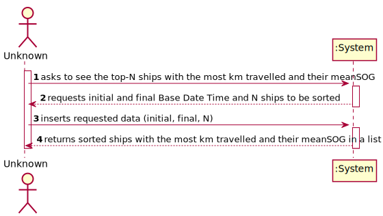


### 1.7 Other Relevant Remarks

n/a


## 2. OO Analysis

### 2.1. Relevant Domain Model Excerpt

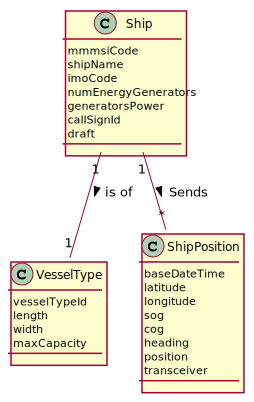

### 2.2. Other Remarks

n/a


## 3. Design - User Story Realization


## 3.2. Sequence Diagram (SD)

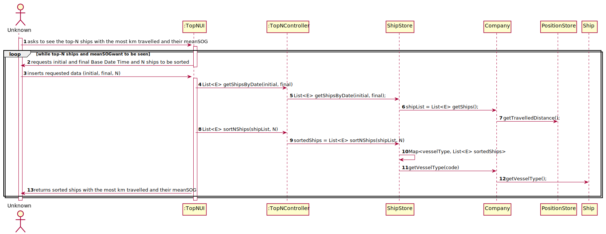


## 3.3. Class Diagram (CD)


# 4. Tests

**ShipBSTTest**

     @Test
    public void getShipsByDateCorrect() throws ParseException {
        *add N ships with different positionBST and different Base Date Time*

        *assert using getShipsByDate(initilDate. finalDate)*
    }
* Test 1: ensures all the ships that fit in the Base Date Time gap are correctly obtained and put in an ArrayList.


    @Test
    public void sortNshipsCorrect() throws ParseException {
        *add N ships to a LinkedList by order of TravelledDistance*
        
        *assert using sortNShips(List<Ship>)*
    }
* Test 2: ensures a list of Ships is ordered correctly by Travelled Distance.


     @Test
    public void getMapWithTopNAssociatedWithVesselType(){
        *create HashMap with LinkedList associated with Ship*
        *create HashMap with HashMap associated with vesselTypeId*
        
        *assert using getShipWithMean(List<Ship>, Integer topN)
    }
* Test 3: ensures every Vessel Type has Top-N Ships with the most Travelled Distance associated with it.


# SPRINT 2

# US 104 - Get Container Situation

## 1. Requirements Engineering

### 1.1. User Story Description

As Client, I want to know the current situation of a specific container being used to transport my goods.

### 1.2. Acceptance Criteria

* Clients provide the container identifier and get the type and the concrete
  instance of its current location, e.g., PORT, Leixões or SHIP, WeFly.

### 1.5 Input and Output Data

**Input Data:**

* Typed data:
  * Container ID
  * Shipment ID

* Selected data:
  * n/a


**Output Data:**

* type and concrete instance of container location


### 1.6. System Sequence Diagram (SSD)

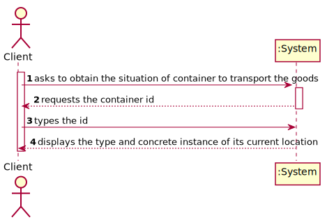


### 1.7 Other Relevant Remarks

n/a


## 2. OO Analysis

### 2.1. Relevant Domain Model Excerpt

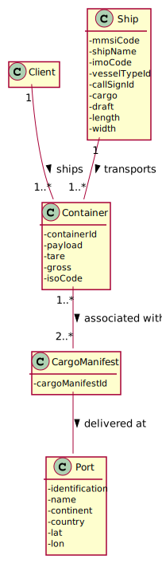

### 2.2. Other Remarks

n/a


## 3. Design - User Story Realization

## 3.1. Sequence Diagram (SD)

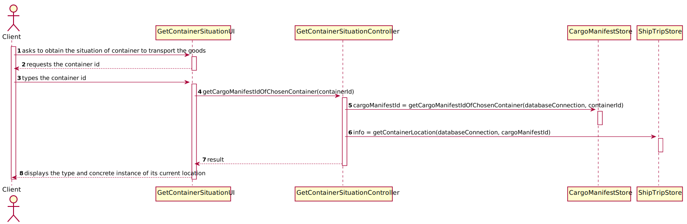

## 3.2. Class Diagram (CD)

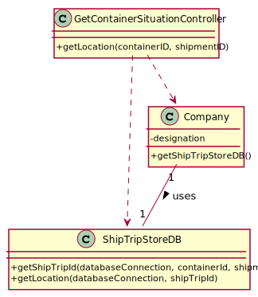

# 4. Tests

For the tests, it is needed to instanciate a Datebaseconnection object and Callable Statement to connect with Data Base.

### ShipTripStoreDB class

**Test 1:** Test to ensure getShipTripID() is functioning correctly.
```
@Test
    public void getShipTripID() {
    }
```

**Test 2:** Test to ensure getLocation() is functioning correctly.
```
@Test
    public void getLocation() {
    }
```

### GetContainerSituationController Class

**Test 3:** Test to ensure getLocation() is functioning properly
```
@Test
    public void getLocation(containerID, shipmentID) {
    }
```


# US 104 - Get Available Ships on Monday Next Week

## 1. Requirements Engineering

### 1.1. User Story Description

As Traffic manager, I need to know which ships will be available on Monday next week and their location.

### 1.2. Acceptance Criteria

* Monday next week is properly identified.
* Only available ships are returned.
* All available ships are returned.

### 1.5 Input and Output Data

**Input Data:**

* Typed data:
  * n/a

* Selected data:
  * n/a


**Output Data:**

* available ships next monday next week


### 1.6. System Sequence Diagram (SSD)

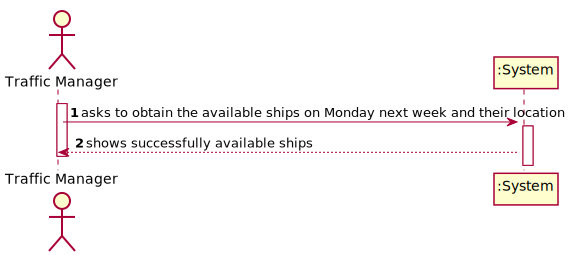


### 1.7 Other Relevant Remarks

n/a


## 2. OO Analysis

### 2.1. Relevant Domain Model Excerpt

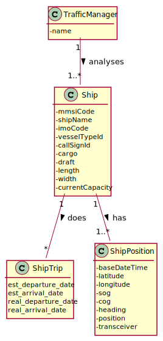

### 2.2. Other Remarks

n/a


## 3. Design - User Story Realization

## 3.1. Sequence Diagram (SD)

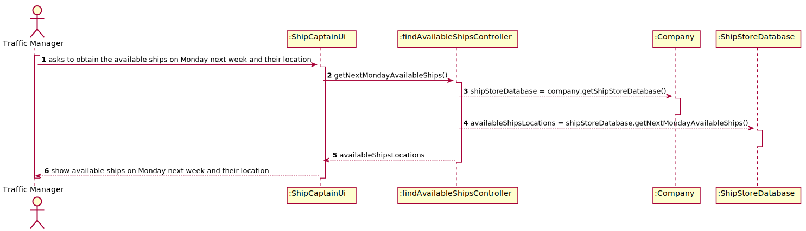

## 3.2. Class Diagram (CD)

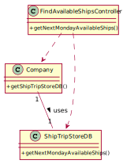

# 4. Tests

For the tests, it is needed to instanciate a Datebaseconnection object and Callable Statement to connect with Data Base.

### ShipTripStoreDB class

**Test 1:** Test to ensure getNextMondayAvailableShips() is functioning correctly.
```
@Test
    public void getNextMondayAvailableShips() {
    }
```

### FindAvailableShipsController Class

**Test 3:** Test to ensure getNextMondayAvailableShips() is functioning properly
```
@Test
    public void getNextMondayAvailableShips() {
    }
```


