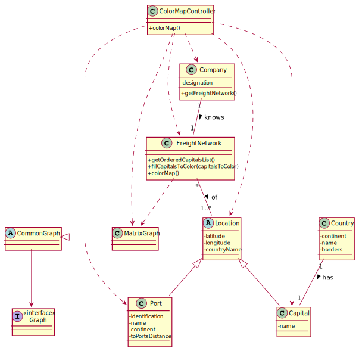

# US 302 - Color Map

## 1. Requirements Engineering

### 1.1. User Story Description

As a Traffic manager I wish to colour the map using as few colours as possible.

### 1.2. Acceptance Criteria

* Neighbouring countries must not share the same colour

### 1.4. Found out Dependencies

* US301: Import data from countries, ports, borders and seadists files from the database to build a freight network.


### 1.5 Input and Output Data

**Input Data:**

* Typed data:
    * n/a

* Selected data:
    * n/a


**Output Data:**

* a Map containing each Capital with its respective color


### 1.6. System Sequence Diagram (SSD)


### 1.7 Other Relevant Remarks

n/a


## 2. OO Analysis

### 2.1. Relevant Domain Model Excerpt


### 2.2. Other Remarks

n/a


## 3. Design - User Story Realization

## 3.1. Sequence Diagram (SD)


## 3.2. Class Diagram (CD)




**ESTOU AQUI**
# 4. Tests

### FreightNetwork class

**Test 1:** Test to ensure getShipByMmsiCode() is functioning correctly.

Situation 1: the user inserts a MMSI code existent in the system
- an expected Ship object should be created
- the MMSI code of the ship should be put in the parameter of the method getShipByMmsiCode(int mmsiCode)
- an actual Ship object through calling the method
- result: the method returns the corresponding Ship and the Ship objects are equal

```
@Test
    public void getShipByExistentMmsiCode() {
    }
```

**Test 2:** Test to ensure getShipByMmsiCode() is functioning correctly.

Situation 2: the user inserts a MMSI code NON existent in the system
* the invalid MMSI code of the ship should be put in the parameter of the method getShipByMmsiCode(int mmsiCode)
* an actual Ship object through calling the method
* result: the method returns null as the Ship with that MMSI doesn't exist

```
@Test
    public void getShipByNonExistentMmsiCode() {
    }
```

### PositionsBST Class

**Test 3:** Test to ensure getPositionalMessages() is functioning properly

Situation 1: the user wishes to see ship positions in a period
* two Date objects should be created with the initial and final date
* an expected List object should be created containing the expected result (toString of multiple ShipPositions objects)
* the actual List object through calling the method getPositionalMessages()
* result: the Lists should be equal

```
@Test
    public void getPositionalMessagesInAPeriod() {
    }
```

**Test 4:** Test to ensure getPositionalMessages() is functioning properly

Situation 2: the user wishes to see ship positions in a date
* a Date object should be created
* an expected List object should be created containing the expected result (toString of multiple ShipPositions objects)
* the actual List object through calling the method getPositionalMessages()
* result: the Lists should be equal

```
@Test
    public void getPositionalMessagesInADate() {
    }
```

**Test 5:** Test to ensure getPositionalMessages() is functioning properly.

Situation 3: there aren't any positional messages found
* two Date objects should be created with the initial and final date
* an expected empty List object
* the actual List object through calling the method getPositionalMessages()
* result: the Lists should be equal

```
@Test
    public void getPositionalMessagesNotFoundInAPeriod() {
    }
```


