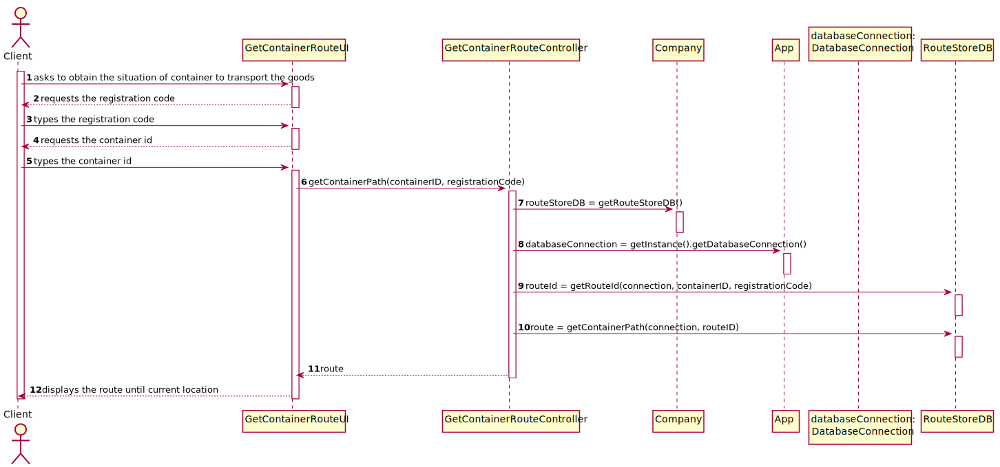

# US 305 - Route of Container

## 1. Requirements Engineering

### 1.1. User Story Description

As Client, I want to know the route of a specific container I am leasing.

### 1.2. Acceptance Criteria

* Users provide their registration code, the container identifier and get its
  path, from source to current location indicating time of arrival and
  departure at each location and mean of transport (ship or truck) between
  each pair of locations.
* When the provided identifier is not valid or, being valid, is not leased by
  the client, a warning is returned.

### 1.4. Found out Dependencies

n/a

### 1.5 Input and Output Data

**Input Data:**

* Typed data:
    * registration code
    * container id

* Selected data:
    * n/a

**Output Data:**

* route of the container until its current location

### 1.6. System Sequence Diagram (SSD)

### 1.7 Other Relevant Remarks

n/a

## 2. OO Analysis

### 2.1. Relevant Domain Model Excerpt

### 2.2. Other Remarks

n/a

## 3. Design - User Story Realization

## 3.1. Sequence Diagram (SD)

## 3.2. Class Diagram (CD)

**ESTOU AQUI**
# 4. Tests

### FreightNetwork class

**Test 1:** Test to ensure getOrderedCapitalsList() is functioning correctly.

- an expected list with all the capitals and its colors
- the list through calling the method 
- checks whether the lists are equal

**Test 2:** Test to ensure getCapitalsToColor() is functioning correctly.

- an expected map with all the capitals and colors set to null
- the map through calling the method
- checks whether the maps are equal

**Test 3:** Test to ensure colorMap() is functioning properly

Situation 1: 
- an expected map with all the capitals and colors
- the map through calling the method
- checks whether the maps are equal

Situation 2:
- the expected minimum colors to be used
- obtain the minimum colors actually used
- checks whether the number of colors are equal

Situation 3: (**for each capital**)
- through the map containing the capitals and colors, obtain the **submap** containing **only** the neighbouring countries of the capital to be tested
- obtain the color of the capital to be tested
- check if the subMap does **not** contain the color of the capital to be tested, meaning **none of the neighbouring countries of the country being tested have the same color of it**

### ColorMapController class

**Test 1:** Test to ensure colorMap() is functioning correctly.

- an expected map with all the capitals and colors set to null
- the map through calling the method
- checks whether the maps are equal

