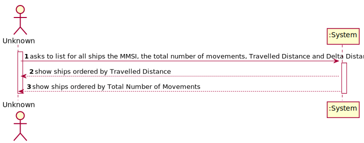
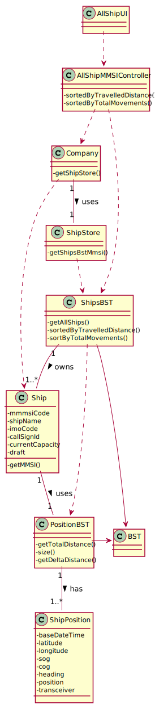

# US 105 - List for all ships the MMSI, the total number of movements, Travelled Distance and Delta Distance

## 1. Requirements Engineering

### 1.1. User Story Description

• US16:As a traffic manager I which to list for all ships the MMSI, the total number of
movements, Travelled Distance and Delta Distance.

### 1.2. Customer Specifications and Clarifications

**From the specifications document:**

> 

**From the client clarifications:**

> **Question:** 
>
> **Answer:** 

-

### 1.3. Acceptance Criteria

* **AC1:** ordered by Travelled Distance and total number of movements
  (descending/ascending).

### 1.4. Found out Dependencies

* US101: As a traffic manager, I which to import ships from a text file into a BST.
* US102: As a traffic manager I which to search the details of a ship using any of its codes:
  MMSI, IMO or Call Sign.
* US104:  As a traffic manager I which to make a Summary of a ship's movements.

### 1.5 Input and Output Data
**Input Data:**

* Initial Base Date Time;
* Final Base Date Time;
* Number of ships to get;

**Output Data:**

* Top-N ships with the most km travelled and their meanSOG
* (In)Success of the operation

### 1.6. System Sequence Diagram (SSD)

### 1.7 Other Relevant Remarks

n/a

## 2. OO Analysis

### 2.1. Relevant Domain Model Excerpt

### 2.2. Other Remarks

n/a

## 3. Design - User Story Realization

### 3.1. Rationale

| Interaction ID | Question: Which class is responsible for... | Answer  | Justification (with patterns)  |
|:-------------  |:--------------------- |:------------|:---------------------------- |
| Step 1  		 |	... interacting with the actor? | TopNUI  |
| 			  	 |	... coordinating the US? | TopNController | Controller                             |
| 	Step 2		  	 |   |   |  |
|   Step 3 		 |	...saving the inputted data? | ShipStore | IE: ShipStore uses data.  | 
|  	Step 4	 |	...return list of ships?  | ShipStore| ShipStore gathers the ship's info accordingly with the initial and final Base Date Time.|

## 3.2. Sequence Diagram (SD)

## 3.3. Class Diagram (CD)

# 4. Tests

    public class PerformanceStoreTest {

    PerformanceStore performanceStore = new PerformanceStore();
    Date start = new Date("2021/5/10");
    Date end = new Date("2021/5/20");

    @Test
    public void getTests() { performanceStore.getTests(1, start, end ); }
    @Test
    public void getTests2() { performanceStore.getTests(2, start, end); }

    @Test
    public void getStatistics() { performanceStore.getStatistics(start, end); }

    @Test
    public void createArray() { performanceStore.createArray(start, end); }
    }

# 5. Construction (Implementation)

## Controller

    public class PerformanceController {

    public void getStatistics(Date start, Date end){
        
    }

    public int[] getSubarray(int option, Date start, Date end){
        
    }
    }

## UI
    public class PerformanceUI implements Runnable {

    @Override
    public void run() {
        boolean bol=false;
        
            *ask start date*

            *ask end date*

            controller.getStatistics(startDate, endDate);
            boolean bol1=false;
            int option;

            
                *choose algorithm*

                if (BruteAlgorithm){
                   *print max sum array*
                }else if (SUM){
                    *print max array*
                }else System.out.println("Insert a valid option");

      }
    }

## Store

    public class PerformanceStore {

    public int[] getTests(int option, Date start, Date end){
        *get max sum array with chosen algorithm*
    }

    public void getStatistics(Date start, Date end){
       *statistics for days, weeks, months and years*
    }

    public int[] createArray(Date start, Date end){
        *create array to be analysed by algorithms*
    }

    }

# 6. Integration and Demo

* A new option to the Administrator Menu was added.
* After logging in as an Administrator, you need to select the "Check Performance" option to proceed.

# 7. Observations

* The statistics must show four graphics for the number of clients, registered tests, tests with results and validated tests.
* One graphic for days, one for weeks, one for months and one for years.
